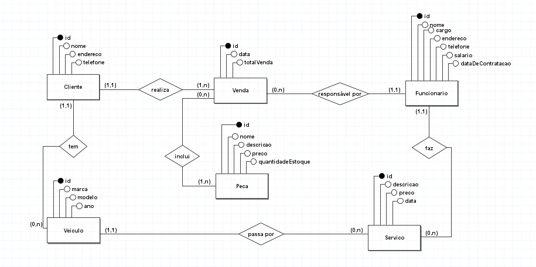

# Atividade Colaborativa: AutoPeças
Repositório para a atividade colaborativa da disciplina DAC 2024.1. Equipe: Gabriella Braga, Maria Clara, Marianna Lopes, Mauricio Bernardo e Veríssimo Terceiro.

## Modelo relacional:


## Script para criação das tabelas:
```sql
CREATE TABLE cliente (
	id serial PRIMARY KEY,
	nome varchar(100) NOT NULL,
	endereco varchar(150) NOT NULL,
	telefone varchar(15) NOT NULL
);

CREATE TABLE funcionario (
	id serial PRIMARY KEY,
	nome varchar(150) NOT NULL,
	cargo varchar(30) NOT NULL,
	endereco varchar(150) NOT NULL,
	telefone varchar(15) NOT NULL,
	salario float NOT NULL,
	dataDeContratacao date NOT NULL
);

CREATE TABLE peca (
	id serial PRIMARY KEY,
	nome varchar(50) NOT NULL,
	descricao varchar(200) NOT NULL,
	preco float NOT NULL,
	quantidadeEstoque int NOT NULL
);

CREATE TABLE veiculo (
	id serial PRIMARY KEY,
	marca varchar(30) NOT NULL,
	modelo varchar(30) NOT NULL,
	ano varchar(4) NOT NULL,

	idCliente int,
	FOREIGN KEY (idCliente) REFERENCES Cliente(id)
);

CREATE TABLE venda (
	id serial PRIMARY KEY,
	data date NOT NULL,
	totalVenda float NOT NULL,

	idCliente int,
	idFuncionario int,
	FOREIGN KEY (idCliente) REFERENCES cliente(id),
	FOREIGN KEY (idFuncionario) REFERENCES funcionario(id)
);

CREATE TABLE servico (
	id serial PRIMARY KEY,
	descricao varchar(150) NOT NULL,
	preco float NOT NULL,
	data date NOT NULL,

	idVeiculo int,
	idFuncionario int,
	FOREIGN KEY (idVeiculo) REFERENCES veiculo(id),
	FOREIGN KEY (idFuncionario) REFERENCES funcionario(id)
);

CREATE TABLE vendaPeca (
	id serial PRIMARY KEY,

	idVenda int,
	idPeca int,
	FOREIGN KEY (idVenda) REFERENCES venda(id),
	FOREIGN KEY (idPeca) REFERENCES peca(id)
);
```